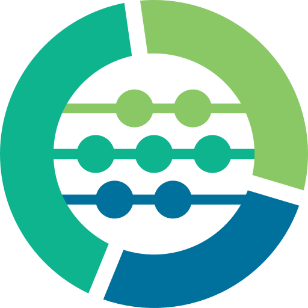
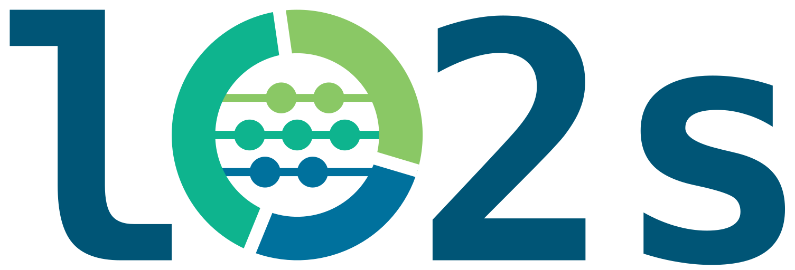

# `lo2s` Logo
This directory contains all data associated to the `lo2s` logo.

## Logo Variants
- `circle`, only circle, transparent background

  

- `circle_fill`, only circle, white background inside circle (outside transparent)

  

- `full`, lo2s name, uses circle logo as o

  
  
## Notes on Design
- font
  - The font is embedded as polygons in the files, no external font required.
  - The used font is [DejaVu Sans Mono](https://dejavu-fonts.github.io/).
- background fill in circle
  - The white background in the `circle_fill` variant is slightly smaller than the outer circle segments.
    Making both the same size leads to a white border looming behind the circle segments when rendering to a pixel image.
    This effect should only become clearly visible in huge resolutions, and if required you can adjust the sizes.

## Building the Logos from Source
Use inkscape to render the `.svg` files in `src/`.
You can invoke that by calling `make`.

This renders `.pdf`, `.png`, and plain (non-inkscape) `.svg` files to `rendered/`.
Always **commit the built files**.

To adjust the height of the `.png` files call `make HEIGHT=1024` with your desired height in pixel,
the width is automatically selected to respect aspect ratio.
Default height is 512 px.

The logo is copied to all files, i.e. when adjusting the circle logo make sure to update the other files as well.

The text is embedded as paths,
but the original text object still exists in the files (but is set to invisble.)
